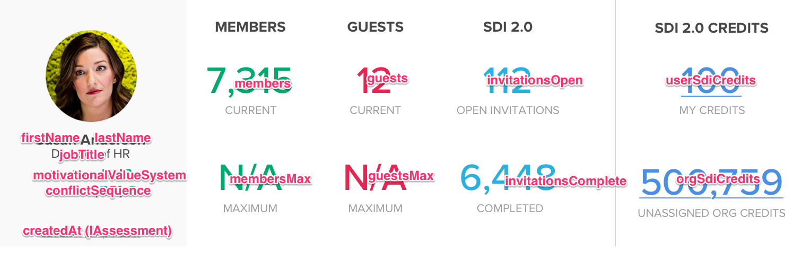

# MOON-LITE Components

## Start Here

*   Read the description, properties and any other information related to the component.
*   Look at all of the Zeplin screens referenced for the component. Make note of any differences between screens. They should be minor and explained in the documentation below. If the provided specification is unclear please immediately ask for clarification.
*   Look at all of the reference code implementations listed, and **do not write components from scratch.** Combining implementations with some changes to support the specifications should be all that is needed.
*   The final component should be completely compatible with storybook and the installed add-ons (knobs, events, and viewport).

## Model Interfaces

```typescript
interface IMotivationalValueSystem {
  color: string;
  red: number;
  green: number;
  blue: number;
}

interface IColors {
  word: string;
  color: string;
  percentage: number;
}

interface IConflictSequenceStages {
  label: string;
  description: string;
  colors: IColors[];
}

interface IConflictSequence {
  color: string;
  red: number;
  green: number;
  blue: number;
  stages: IConflictSequenceStages
}

interface IAssessmentResults {
  motivationalValueSystem: IMotivationalValueSystem;
  conflictSequence: IConflictSequence;
}

interface IAssessment {
  createdAt: string;
  results: IAssessmentResults;
}

interface IUserAssessments {
  default: IAssessment;
}

interface ICompany {
  id: number;
  name: string;
  streetAddress1: string;
  streetAddress2: string;
  city: string;
  stateProvince: string;
  country: string;
  postalCode: string;
  phoneNumber: string;
  images: ICompanyImages;
}

interface IProfileImages {
  avatarUrl: string;
  monumentUrl: string;
}

interface IUser {
  id: string;
  firstName: string;
  lastName: string;
  emailAddress: string;
  profileImages: IProfileImages;
  jobTitle: string;
  company: ICompany;
  language: string;
  assessments: IUserAssessments;
}
```

---

## Components

### ✪ Header

#### Description

(See [https://trello.com/c/T2XMmrAc](https://trello.com/c/T2XMmrAc))

*   Fills width of parent containers
*   Title and sub-title can accept and render markdown

#### Properties

```typescript
@Input title?: string;
@Input subTitle?: string;
@Input stepsTotal?: string;
@Input stepsComplete?: string;
@Input backgroundColor?: string;
@Input nextIcon?: string;
@Output() back: EventEmitter<any> = new EventEmitter();
@Output() next: EventEmitter<any> = new EventEmitter();
```

##### Title Only ([https://zpl.io/agnJjv9](https://zpl.io/agnJjv9))


##### Title, Sub-Title Only ([https://zpl.io/am67OW9](https://zpl.io/am67OW9))


##### Title with Markdown ([https://zpl.io/2j8vK84](https://zpl.io/2j8vK84))


##### Back and Title ([https://zpl.io/25yBBpn](https://zpl.io/25yBBpn))


##### Back, Title and Context Menu ([https://zpl.io/bzMZrW8](https://zpl.io/bzMZrW8))


##### Back, Title, Sub-Title and Completion ([https://zpl.io/VK0zeq7](https://zpl.io/VK0zeq7))


##### Back, Title, Sub-Title and Home Icon ([https://zpl.io/bok4GgG](https://zpl.io/bok4GgG))


---

### ✪ User Overview

#### Description

(See [https://trello.com/c/GNeBT0Ml](https://trello.com/c/GNeBT0Ml))

*   The component is split into 3 parts: the left part with the avatar image, the middle part with 2-3 columns of data, a vertical divider, and then the right part. The left and right parts of the component are shown at their maximum sizes in the Zeplin spec. They can shrink if needed, but should not expand when the viewport expands from table to desktop width.

#### Properties

```typescript
@Input user: IUser;
@Input members: number;
@Input membersMax: number;
@input guests: number;
@Input guestsMax: number;
@Input invitationsOpen: number;
@Input invitationsComplete: number;
@Input userSdiCredits: number;
@Input orgSdiCredits: number;
```

#### Implementations

##### ALPHA

**Property Binding Map**


###### Reference

*   Code
    *   `src/app/ALPHA/src/app/shared/components/overview`
*   Zeplin
    *   [https://zpl.io/bW19NQx](https://zpl.io/bW19NQx)
    *   [https://zpl.io/VQWGvMA](https://zpl.io/VQWGvMA)
    *   [https://zpl.io/Vq60vOY](https://zpl.io/Vq60vOY)
    *   [https://zpl.io/2vBzOyn](https://zpl.io/2vBzOyn)
    *   [https://zpl.io/brkevm5](https://zpl.io/brkevm5)
    *   [https://zpl.io/295JRMw](https://zpl.io/295JRMw)
    *   [https://zpl.io/VOBg8MQ](https://zpl.io/VOBg8MQ)
    *   [https://zpl.io/aXWo8Zl](https://zpl.io/aXWo8Zl)
    *   [https://zpl.io/aBOl0d0](https://zpl.io/aBOl0d0)

##### CHARLIE

###### Property Binding Map

See ALPHA

###### Reference

*   Code
    *   `src/psp/moon-lite/src/app/ALPHA/src/app/shared/components`
*   Zeplin
    *   [https://zpl.io/2vBqoze](https://zpl.io/2vBqoze)
    *   [https://zpl.io/2GzNdwj](https://zpl.io/2GzNdwj)
    *   [https://zpl.io/VYJZ73k](https://zpl.io/VYJZ73k)
    *   [https://zpl.io/VQWO7JR](https://zpl.io/VQWO7JR)
    *   [https://zpl.io/aBO9G3O](https://zpl.io/aBO9G3O)
    *   [https://zpl.io/aXWrJZj](https://zpl.io/aXWrJZj)

---

### ✪ Facilitator Overview

#### Description

(See [https://trello.com/c/ohQmxHIz](https://trello.com/c/ohQmxHIz))

#### Properties

```typescript
@Input user: IUser;
@Input orgAdmin: boolean;
@Input facilitatorId: string;
@Input facilitatorRating: number;
@Input facilitatorEvaluations: number;
@Input trainedClasses: number;
@Input trainedLearners: number;
@Input orgToolkits: number;
@Input orgSdiCredits: number;

// If `orgAdmin` is `true`
// use the blue background color (4cafd6) and white foreground color,
// otherwise use the default background and foreground color.
@Input orgAdmin: boolean;

@Input platformKey;

// Emit the `platformKey` property from the platform key input.
@Output regenPlatformKey: EventEmitter<any> = new EventEmitter(platformKey: string);

// Copy the `platformKey` property from the platform key input.
@Output copyPlatformKey: EventEmitter<any> = new EventEmitter(platformKey: string);
@Output showTransactions: EventEmitter<any> = new EventEmitter();
```

#### Implementations

##### FOXTROT

###### Property Binding Map


###### Reference

*   Code
    *   `src/app/FOXTROT/src/app/train/overview`
*   Zeplin
    *   [https://zpl.io/29Dq1OA](https://zpl.io/29Dq1OA)
    *   [https://zpl.io/VOWNZnY](https://zpl.io/VOWNZnY)
    *   [https://zpl.io/bAvmQXB](https://zpl.io/bAvmQXB)
    *   [https://zpl.io/2ZxyXeX](https://zpl.io/2ZxyXeX)
    *   [https://zpl.io/bLNm1yD](https://zpl.io/bLNm1yD)
    *   [https://zpl.io/brknPDL](https://zpl.io/brknPDL)
    *   [https://zpl.io/2yBwPNG](https://zpl.io/2yBwPNG)


##### HOTEL

###### Property Binding Map


###### Reference

*   Code
    *   `src/app/HOTEL/src/app/facilitators/facilitator-overview`
*   Zeplin
    *   [https://zpl.io/bzM8E9A](https://zpl.io/bzM8E9A)
    *   [https://zpl.io/a8ZJlxX](https://zpl.io/a8ZJlxX)
    *   [https://zpl.io/a8Zjrv6](https://zpl.io/a8Zjrv6)
    *   [https://zpl.io/a7ylrxR](https://zpl.io/a7ylrxR)

---

### ✪ TBD

#### Description

...

#### Properties

```typescript
```

#### Implementations

...

###### Property Binding Map


###### Reference
*   Code
*   Zeplin
